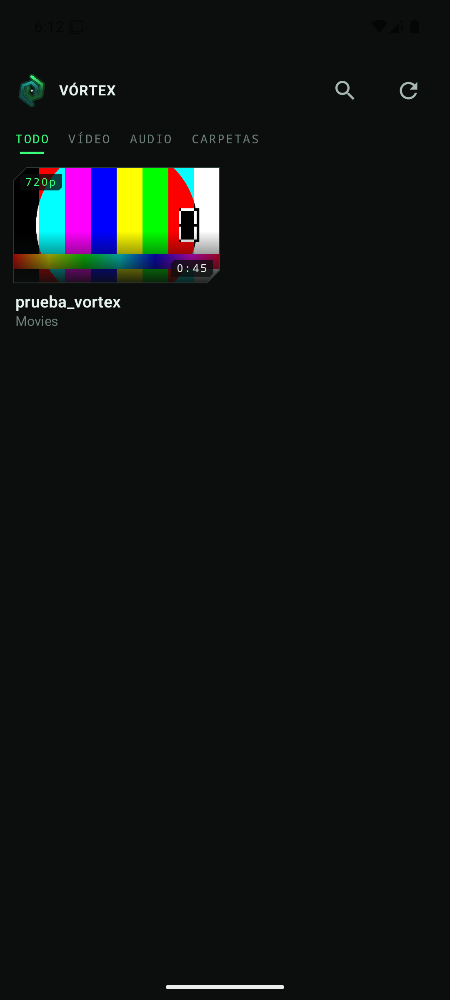
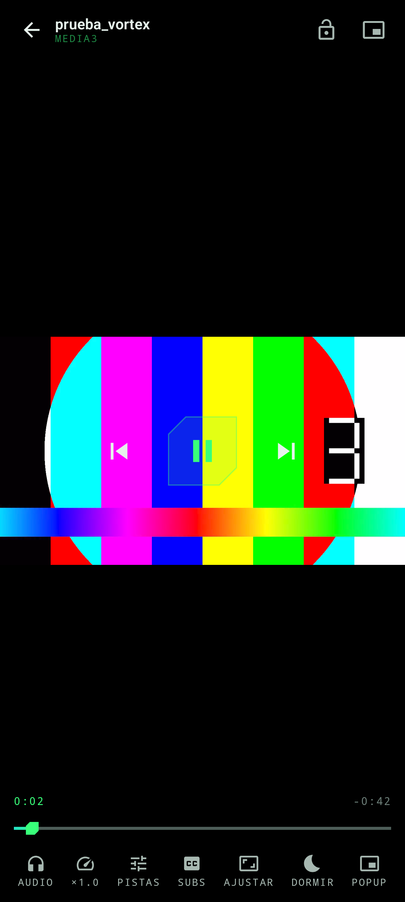
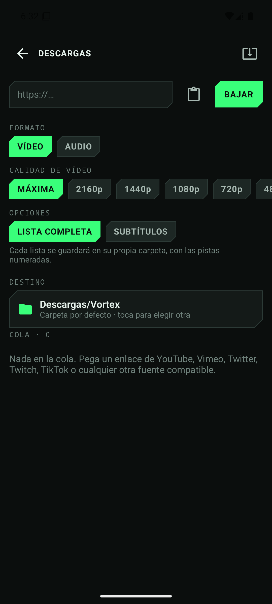

# Vórtex

Reproductor de medios para Android con doble motor, ventana flotante y descargas
integradas. Pensado para plantarle cara a VLC y MX Player sin heredar sus interfaces.

<p align="center">
  
  
  
</p>

## Qué hace distinto

**Dos motores, una sola sesión.** Media3/ExoPlayer lleva la reproducción normal porque es
más eficiente y se integra con el sistema sin fricción. Cuando se topa con un códec o un
contenedor que no entiende, Vórtex rescata la posición exacta y levanta **libVLC** en su
lugar. El usuario ve un parpadeo y el vídeo sigue; no hay diálogo de error. La insignia
`MEDIA3` / `VLC` del HUD dice en todo momento quién está reproduciendo.

Técnicamente esto es posible porque libVLC va envuelto en un `SimpleBasePlayer` de Media3
(`playback/VlcPlayer.kt`), así que ambos motores hablan la misma interfaz `Player` y
comparten una única `MediaSession`. Notificación, pantalla de bloqueo, mandos Bluetooth,
ventana flotante y reproductor funcionan igual con cualquiera de los dos.

**Un MP4 suena como un MP3.** El modo solo-audio apaga la decodificación de vídeo sin
tocar el audio ni la posición: en Media3 desactivando el tipo de pista en el selector, en
VLC con `setVideoTrackEnabled(false)`. Se puede activar desde la biblioteca, desde el
reproductor **y desde la propia ventana flotante**, sin cortar el sonido.

**Ventana flotante de verdad.** No es el PiP del sistema (que también está): es una
ventana propia por encima de cualquier app, que se arrastra con un dedo, se redimensiona
con dos y lleva dentro el interruptor de solo-audio.

**Descargas con yt-dlp.** YouTube, Vimeo, Twitch, TikTok, Twitter y todo lo que soporte
yt-dlp. Busca por texto o pega un enlace, previsualiza listas con miniaturas y elige qué
elementos bajar. Vídeo hasta 4K o extracción de audio a MP3/M4A/OPUS/FLAC/WAV. Las listas
de reproducción **crean automáticamente su propia carpeta** con las pistas numeradas; cada
elemento entra como trabajo independiente, así que un fallo no obliga a repetir la lista.
El destino lo elige el usuario con el selector de carpetas del sistema. La cola puede
ejecutar entre **1 y 10 descargas simultáneas**, elegidas con un deslizador o tocando el
número; cada trabajo activo conserva progreso y cancelación propios. El motor inteligente
puede reducir ese límite según batería, memoria y temperatura, aplicar cupos distintos a
YouTube y otras fuentes, esperar Wi-Fi/cargador/horario y limitar el ancho de banda. Los
fallos temporales se reintentan con espera progresiva conservando el archivo `.part`, y los
trabajos pendientes se pueden mover al inicio o al final de la cola.

YouTube usa automáticamente el QuickJS incluido en el APK y los componentes EJS de
`yt-dlp`. Si aparece la comprobación anti-bot, Vórtex prueba una ruta pública alternativa
sin pedir cuentas ni importar cookies. Los fallos de formato, JavaScript, FFmpeg y
postprocesado permanecen visibles en la cola en vez de convertirse en un error genérico.

**Enlaces de Spotify.** Pega una canción, un álbum o una lista y Vórtex lee **sólo los
metadatos** del catálogo —título, artista, duración y portada—, busca cada tema en
YouTube filtrando por duración y etiqueta el resultado con esos datos. El audio de
Spotify va cifrado y no se toca: es el mismo enfoque de spotDL. Cada canción entra en la
cola por separado, así que una lista de ochenta temas no se pierde porque falle uno. El
motor de catálogo se actualiza por separado mediante un manifiesto declarativo validado:
puede adaptarse a cambios de estructura de Spotify sin descargar ni ejecutar código.
Además, el lector reconoce estados hidratados alternativos y entidades serializadas para
resistir despliegues A/B que muevan los datos sin previo aviso.
Los enlaces abreviados de `open.spotify.com/s/` se mantienen dentro del flujo de Spotify:
nunca se entregan al descargador como si fueran audio ni provocan reintentos DRM.

**Tu Spotify (beta).** La conexión oficial usa OAuth 2.0 con PKCE: Vórtex nunca incluye
ni solicita un `client secret`. El Hub sincroniza las playlists autorizadas de la cuenta,
mantiene una caché local para poder consultarlas sin conexión y busca coincidencias con
la música que ya existe en el teléfono. Sólo reproduce esos archivos locales o abre la
canción en Spotify; la API oficial no forma parte del motor de descargas. Al desconectar
la cuenta se eliminan sus datos de la caché.

**Aspecto al estilo VLC.** Ajustar, llenar, estirar y relaciones forzadas (16:9, 4:3,
18:9, 21:9, 1:1) para cuando un fichero trae mal los metadatos, más zoom por pellizco
encima de cualquier preset.

**Se actualiza sola.** Vórtex consulta las publicaciones de este repositorio, elige el APK
que corresponde a la arquitectura del móvil, lo descarga con progreso y se lo entrega al
instalador del sistema. Al no estar en ninguna tienda, esta es la vía para no quedarse
atrás sin depender de que alguien recuerde volver aquí.

## Otras funciones

- Biblioteca por MediaStore con miniaturas extraídas del propio vídeo y caché en disco.
- Árbol de carpetas navegable, con ramas plegables y migas de pan.
- Búsqueda unificada por nombre de fichero, carpeta y ruta, con resultados agrupados.
- Orden por fecha, nombre, duración, tamaño o resolución, y vista rejilla o lista.
- Selección múltiple con acciones en bloque, listas de reproducción propias y favoritos.
- "Continuar viendo" con la posición guardada cada 4 segundos, resistente a cierres bruscos.
- Gestos: brillo a la izquierda, volumen a la derecha, arrastre horizontal para buscar,
  doble toque lateral para ±10 s, bloqueo de controles.
- Selección de pistas de audio y subtítulos, velocidad de 0,5× a 3× con corrección de tono.
- Temporizador de apagado.
- Reproducción en segundo plano con la pantalla apagada.
- Se abre desde otras apps para cualquier `video/*`, `audio/*`, HLS, RTSP, RTMP y MMS.

## Instalación

Descarga el APK de tu arquitectura desde [Releases](../../releases):

| Archivo | Para |
|---|---|
| `app-arm64-v8a-release.apk` | Prácticamente todos los móviles actuales |
| `app-armeabi-v7a-release.apk` | Móviles antiguos de 32 bits |
| `app-x86_64-release.apk` | Emuladores y algunos Chromebooks/dispositivos Intel |

Se publica un APK por arquitectura porque libVLC y el intérprete de Python de yt-dlp pesan
unas decenas de megas **por ABI**; un único APK universal rondaría los 250 MB.

Requiere Android 7.0 (API 24) o superior.

### Catálogos

Los metadatos de tienda están en `fastlane/metadata/android/` (formato fastlane, que es el
que consumen F-Droid e IzzyOnDroid), en español e inglés.

**IzzyOnDroid** es el catálogo objetivo: indexa los APK firmados de las Releases de este
repositorio y da actualizaciones automáticas a través del cliente de F-Droid.

**f-droid.org** propiamente dicho compila desde el código fuente en su propio servidor y
rechaza los binarios precompilados. Vórtex incluye tres (libVLC, el intérprete de Python de
yt-dlp y ffmpeg), así que entrar ahí exigiría compilarlos también desde fuente. No es
imposible —VLC lo hace— pero es un proyecto en sí mismo.

## Permisos y por qué

| Permiso | Para qué |
|---|---|
| `READ_MEDIA_VIDEO` / `READ_MEDIA_AUDIO` | Construir la biblioteca. Nada sale del dispositivo. |
| `SYSTEM_ALERT_WINDOW` | La ventana flotante sobre otras apps. |
| `FOREGROUND_SERVICE_MEDIA_PLAYBACK` | Seguir sonando con la app cerrada. |
| `FOREGROUND_SERVICE_DATA_SYNC` | Que las descargas no se corten al salir de la app. |
| `POST_NOTIFICATIONS` | Controles en la notificación y progreso de descarga. |
| `INTERNET` | Streaming y descargas. |
| `ACCESS_NETWORK_STATE` | Respetar el modo sólo Wi-Fi y esperar una conexión válida. |

## Compilar

```bash
git clone https://github.com/giver720/vortex-player.git
cd vortex-player
./gradlew assembleDebug
```

Para una build de release firmada, crea `keystore.properties` en la raíz:

```properties
storeFile=../keystore/mi-clave.jks
storePassword=…
keyAlias=…
keyPassword=…
```

Sin ese fichero el proyecto compila igual; las builds de release simplemente salen sin firmar.

## Arquitectura

```
app/src/main/java/com/vortex/player/
├── data/            Biblioteca (MediaStore) y persistencia (Room)
├── playback/        Motores, abstracción de pistas y MediaSessionService
│   ├── VlcPlayer.kt         libVLC expuesto como Player de Media3
│   ├── ExoEngineControls.kt Pistas y salida de vídeo en Media3
│   └── PlaybackService.kt   Sesión única + conmutación de motor
├── popup/           Ventana flotante (overlay + Compose)
├── download/        yt-dlp, cola, destino y publicación en la mediateca
├── spotify/         Catálogo, reglas actualizables, paginación y etiquetas
├── update/          Comprobación, descarga e instalación desde las Releases
└── ui/              Compose: biblioteca, reproductor, descargas, tema HUD
```

## Aviso

yt-dlp se incluye para descargar contenido propio o de libre distribución. Respeta los
términos de servicio de cada plataforma y los derechos de autor del material que descargues.

## Licencia

GPL-3.0, por compatibilidad con libVLC y yt-dlp.
